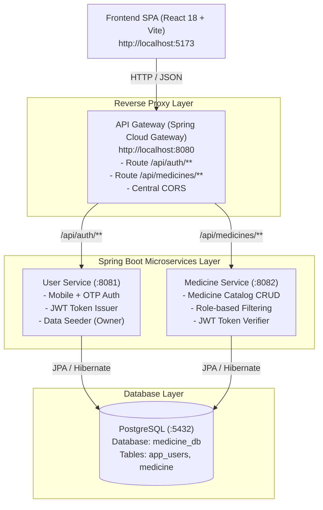
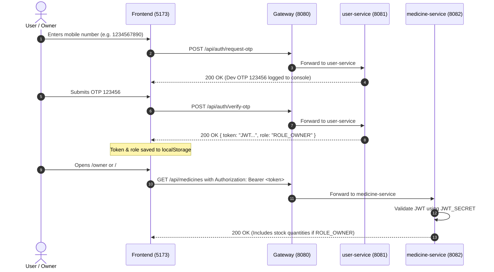

# Project Guide — Medicine Management System

> **Single Source of Truth** for the Medicine Management System.  
> Use this document to pick up development, understand architecture, run services, and track project roadmap.  
> Last updated: 2026-10-07

---

## 1. Project Overview

The **Medicine Management System** is a full-stack, microservices-based web application for managing and browsing a pharmacy/medicine catalog.

### Core Capabilities
- **Public / Visitors:** Browse medicine catalog, search medicines by name (case-insensitive), view prices and descriptions. Stock quantities are hidden.
- **Customers:** Log in with mobile number via OTP verification. Can browse and view the catalog.
- **Store Owner:** Log in with designated owner mobile number (`1234567890`). Has full administrative permissions: view real-time stock quantities, add new medicines, update existing medicine details, and delete entries.

---

## 2. System Architecture

The project follows a **Microservices Architecture** with a single API Gateway acting as the reverse proxy for two domain services, communicating with a shared PostgreSQL database.



### Architectural Principles
1. **Gateway as Single Entry Point:** The client only talks to the API Gateway (`:8080`). No client traffic goes directly to services `:8081` or `:8082`.
2. **Stateless Security via JWT:**
   - `user-service` **issues** HMAC-signed JWTs containing `sub` (mobile number) and `role` (`ROLE_OWNER` or `ROLE_CUSTOMER`).
   - `medicine-service` **verifies** JWTs using the identical `JWT_SECRET`.
   - The Gateway does not validate tokens; it transparently forwards Authorization headers.
3. **Role-Based Data Filtering:** `medicine-service` checks the security context. If the caller is not `ROLE_OWNER`, the `quantity` attribute is sanitized to `null` and excluded from the JSON payload.
4. **Shared Database:** Both services connect to `medicine_db`. Schema generation is managed via Hibernate (`ddl-auto=update`).

---

## 3. Technology Stack

| Layer | Technologies & Frameworks | Details |
|---|---|---|
| **Backend** | Java 17, Spring Boot 3.3.4 | Spring Data JPA, Hibernate, Bean Validation, Lombok, Actuator |
| **Gateway** | Spring Cloud Gateway (2023.0.3) | Reactive routing, Global CORS management |
| **Security** | Spring Security 6, JJWT 0.12.6 | JWT HMAC-SHA, Bearer token authentication |
| **Database** | PostgreSQL | Shared database `medicine_db` |
| **Frontend** | React 18, Vite 5, Material UI (MUI 5) | Axios, React Router v6, i18next (localization) |
| **Deployment** | Docker, Render Blueprint (`render.yaml`) | Multi-stage Docker builds, Render hosted DB & services |

---

## 4. Complete Directory & File Structure

```
medicine-management-system-main/
│
├── docs/                                    # Documentation directory
│   └── PROJECT_GUIDE.md                     # This master guide
│
├── CLAUDE.md                                # Quick cheatsheet for AI / developers
├── README.md                                # Root project documentation
├── render.yaml                              # Render Infrastructure as Code (Blueprint)
│
├── api-gateway/                             # Spring Cloud Gateway Service (Port 8080)
│   ├── Dockerfile                           # Container definition
│   ├── pom.xml                              # Maven dependencies
│   └── src/main/
│       ├── java/com/medicine/gateway/
│       │   └── ApiGatewayApplication.java   # Gateway main entry point
│       └── resources/
│           └── application.yml              # Central routing & CORS rules
│
├── user-service/                            # Authentication Service (Port 8081)
│   ├── Dockerfile
│   ├── pom.xml
│   └── src/main/
│       ├── java/com/medicine/user/
│       │   ├── UserServiceApplication.java  # Main application entry point
│       │   ├── config/DataSeeder.java       # Seeds owner mobile '1234567890' on startup
│       │   ├── controller/AuthController.java # /api/auth/request-otp, /verify-otp
│       │   ├── dto/
│       │   │   ├── RequestOtpRequest.java   # Mobile number input
│       │   │   ├── VerifyOtpRequest.java    # Mobile + OTP input
│       │   │   └── LoginResponse.java       # Returns {token, role}
│       │   ├── model/User.java              # Entity mapping table 'app_users'
│       │   ├── repository/UserRepository.java # Spring Data JPA repository
│       │   └── service/
│       │       ├── AuthService.java         # OTP generation & validation logic
│       │       └── JwtService.java          # JWT signing logic (4-hr validity)
│       └── resources/
│           └── application.properties       # Port 8081, DB config, JWT secret, dev OTP
│
├── medicine-service/                        # Catalog & Inventory Service (Port 8082)
│   ├── Dockerfile
│   ├── pom.xml
│   └── src/main/
│       ├── java/com/medicine/catalog/
│       │   ├── MedicineCatalogApplication.java # Main application entry point
│       │   ├── controller/MedicineController.java # CRUD endpoints on /api/medicines
│       │   ├── dto/
│       │   │   ├── MedicineRequest.java     # Request validation (name, price, quantity)
│       │   │   └── MedicineResponse.java    # Response DTO (@JsonInclude NON_NULL)
│       │   ├── mapper/MedicineMapper.java   # Filters out quantity for non-owners
│       │   ├── model/Medicine.java          # Entity mapping table 'medicine'
│       │   ├── repository/MedicineRepository.java # Search & CRUD repository
│       │   ├── security/
│       │   │   ├── JwtAuthFilter.java       # Parses Bearer token into SecurityContext
│       │   │   └── SecurityConfig.java      # Enforces GET=public, POST/PUT/DELETE=owner
│       │   └── service/MedicineService.java # Catalog business logic
│       └── resources/
│           └── application.properties       # Port 8082, DB config, shared JWT secret
│
└── frontend/                                # React SPA (Port 5173)
    ├── package.json                         # Dependencies & scripts
    ├── vite.config.js                       # Vite build configuration
    ├── index.html                           # Single page entry HTML
    ├── .env.example                         # Example environment variables
    ├── .env.production                      # Production environment variables
    └── src/
        ├── main.jsx                         # React root (Router > Theme > Auth > App)
        ├── App.jsx                          # Route definitions & RequireOwner guard
        ├── theme.js                         # Material-UI theme styling
        ├── api/medicineApi.js               # Central Axios client with auth interceptor
        ├── auth/AuthContext.jsx             # React Auth context (login, logout, isOwner)
        ├── components/NavBar.jsx            # Top navigation bar
        ├── pages/
        │   ├── UserPage.jsx                 # Public / customer catalog view & search
        │   ├── LoginPage.jsx                # Two-step OTP login modal/page
        │   └── OwnerPage.jsx                # Owner dashboard (stock, add, edit, delete)
        └── i18n/
            ├── i18n.js                      # i18next configuration
            └── locales/en.json              # All user-facing UI text strings
```

---

## 5. Authentication & Authorization Flow



### Credentials & Roles
| Role | Mobile Number | Dev OTP | Capabilities |
|---|---|---|---|
| **Owner** | `1234567890` | `123456` | View stock, create, update, delete medicines |
| **Customer** | Any valid 10-digit mobile | `123456` | Browse medicines, search catalog |
| **Visitor** | *(Unauthenticated)* | *(None)* | Browse medicines, search catalog |

---

## 6. API Reference

All requests are routed through the Gateway at `http://localhost:8080`.

| Method | Endpoint | Required Role | Description |
|---|---|---|---|
| `POST` | `/api/auth/request-otp` | Public | Generates dev OTP for the given mobile number. |
| `POST` | `/api/auth/verify-otp` | Public | Verifies OTP and returns `{ token, role }`. |
| `GET` | `/api/medicines` | Public | Lists all medicines (quantity included only for owner). |
| `GET` | `/api/medicines?search={term}`| Public | Searches medicines by name containing term. |
| `GET` | `/api/medicines/{id}` | Public | Fetches single medicine details by ID. |
| `POST` | `/api/medicines` | `ROLE_OWNER` | Creates a new medicine entry. |
| `PUT` | `/api/medicines/{id}` | `ROLE_OWNER` | Updates an existing medicine entry. |
| `DELETE`| `/api/medicines/{id}` | `ROLE_OWNER` | Deletes a medicine entry. |

#### Medicine Request Payload Example:
```json
{
  "name": "Paracetamol 500mg",
  "description": "Pain reliever and fever reducer",
  "price": 15.50,
  "quantity": 100
}
```

---

## 7. How to Run Locally

### Prerequisites
- **Java 17** (verified on system)
- **Maven 3.9+** (verified on system)
- **Node.js 18+ & npm** (verified on system)
- **PostgreSQL 14+** running on `localhost:5432` with database `medicine_db`

### Startup Sequence

Open separate terminal windows and run each service in this exact order:

#### Step 1: Database Setup
Ensure PostgreSQL is running and database exists:
```sql
CREATE DATABASE medicine_db;
```
*(Default user: `postgres`, password: `test`)*

#### Step 2: Start `user-service`
```powershell
cd user-service
mvn spring-boot:run
```
*Runs on port `8081`.*

#### Step 3: Start `medicine-service`
```powershell
cd medicine-service
mvn spring-boot:run
```
*Runs on port `8082`.*

#### Step 4: Start `api-gateway`
```powershell
cd api-gateway
mvn spring-boot:run
```
*Runs on port `8080`.*

#### Step 5: Start `frontend`
```powershell
cd frontend
npm install
npm run dev
```
*Runs on `http://localhost:5173`.*

---

## 8. Environment Variables Reference

| Variable | Default Value | Used By | Description |
|---|---|---|---|
| `DB_HOST` | `localhost` | `user-service`, `medicine-service` | PostgreSQL host |
| `DB_PORT` | `5432` | `user-service`, `medicine-service` | PostgreSQL port |
| `DB_NAME` | `medicine_db` | `user-service`, `medicine-service` | PostgreSQL database name |
| `DB_USERNAME` | `postgres` | `user-service`, `medicine-service` | DB username |
| `DB_PASSWORD` | `test` | `user-service`, `medicine-service` | DB password |
| `JWT_SECRET` | `dev-super-secret-key-change-me-please-1234567890` | `user-service`, `medicine-service` | **Must be identical** across both services |
| `SERVER_PORT` | `8080` / `8081` / `8082` | All services | Service HTTP port |
| `USER_SERVICE_URI` | `http://localhost:8081` | `api-gateway` | Gateway route target for auth |
| `MEDICINE_SERVICE_URI` | `http://localhost:8082` | `api-gateway` | Gateway route target for catalog |
| `CORS_ALLOWED_ORIGIN` | `http://localhost:5173` | `api-gateway` | Frontend URL allowed by CORS |
| `VITE_API_BASE_URL` | `http://localhost:8080/api` | `frontend` | Base API URL prefix |

---

## 9. Current Status & Known Issues

### Status Summary
- [x] **Phase 1: Catalog CRUD & Search:** Completed.
- [x] **Phase 2: OTP Login, JWT Auth, Microservices & Gateway:** Completed.
- [ ] **Phase 3: Extended Features & Production Readiness:** Open for development.

### Known Issues & Technical Debt
1. **Token Expiry on Frontend:** When the 4-hour JWT token expires, requests fail silently without redirecting the user to `/login`.
2. **Missing Tests:** Currently there are zero unit or integration tests in any service.
3. **Database Constraints:** `medicine` table has no unique constraint on `name` at the database level.
4. **Dev OTP:** OTP is hardcoded to `123456` without rate limiting or SMS gateway integration.
5. **Render Blueprint (`render.yaml`):** ✅ Fully configured with internal private networking (`http://user-service:8081`, `http://medicine-service:8082`), wildcard CORS origin (`https://*.onrender.com`), and dynamic frontend base URL resolution.

---

## 10. Next Development Phase (How to Continue)

When continuing work on this project, here are the recommended next milestones:

### Option A: Customer Shopping & Ordering (High Value Feature)
1. **Order / Cart Service:** Create a new microservice (`order-service`) or entity allowing customers to add medicines to a cart and place an order.
2. **Stock Deduction:** Automatically decrement medicine stock in `medicine-service` when an order is completed.
3. **Customer Order History:** New frontend view for customers to track their previous orders.

### Option B: Quality & Production Hardening
1. **Automated Testing:** Add Spring Boot `@SpringBootTest` / Mockito test suites to `user-service` and `medicine-service`, plus Vitest for frontend.
2. **Docker Compose:** Add a `docker-compose.yml` file to spin up PostgreSQL, all 3 backend services, and the frontend with a single command (`docker compose up`).
3. **Frontend Token Handling:** Add Axios response interceptor for 401 errors that auto-clears localStorage and navigates to `/login`.
4. **Real SMS Gateway:** Integrate Twilio or AWS SNS for real OTP generation with a 5-minute expiration cache (Redis or in-memory).
